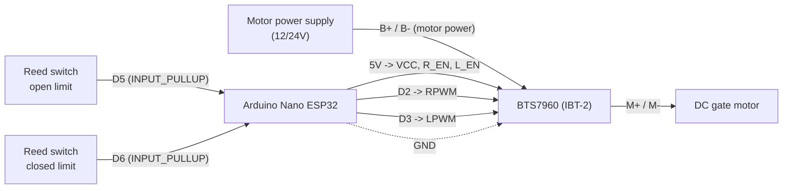

# Hardware

Wiring, pin mapping, and power/safety notes for the gate motor circuit driven by the
firmware in `firmware/`. Pin constants referenced here are defined in
`firmware/include/config.h`.

## Bill of materials

| Part | Notes | Qty |
|---|---|---|
| Arduino Nano ESP32 | ESP32-S3 via u-blox NORA-W106 | 1 |
| BTS7960 motor driver module (IBT-2) | Dual MOSFET half-bridge, high current, low voltage drop | 1 |
| DC gate motor | 12V or 24V geared motor, reversible | 1 |
| Magnetic reed switch | Normally-open, one per travel limit | 2 |
| Power supply | Sized to the motor's stall current, matches its voltage | 1 |

## Wiring diagram

## Pin mapping (Arduino Nano ESP32)

| Nano ESP32 pin | Connects to | Purpose |
|---|---|---|
| `D2` | BTS7960 `RPWM` | Direction + speed — PWM to open |
| `D3` | BTS7960 `LPWM` | Direction + speed — PWM to close |
| `5V`/`VBUS` | BTS7960 `VCC`, `R_EN`, `L_EN` | Logic supply; both enables tied directly to VCC (not MCU-driven) |
| `D5` | Reed switch — open limit | `INPUT_PULLUP`; reads LOW when fully open |
| `D6` | Reed switch — closed limit | `INPUT_PULLUP`; reads LOW when fully closed |
| `GND` | BTS7960 `GND` + power supply `GND` | Common ground — required |

Pins are referenced by their Arduino symbolic names (`D2`/`D3`/`D5`/`D6`), not raw
GPIO numbers — see `firmware/README.md` for why.

## BTS7960 connections

- `RPWM`/`LPWM` — direction and speed control from the Nano ESP32. Firmware
  guarantees these are never both active at the same time (see `motor_control` in
  `firmware/README.md`).
- `R_EN`/`L_EN` — tied directly to `VCC` (not driven by the Nano ESP32), so both
  channels are always enabled and only `RPWM`/`LPWM` gate whether they drive.
- `VCC`/`GND` — 5V logic supply for the module's onboard gate-driver ICs, kept
  separate from the motor's high-current `B+` rail (see Power requirements below).
- `M+`/`M-` — to the DC motor terminals.
- `B+`/`B-` (motor power supply input) — from the power supply, sized to the motor's
  voltage and stall current.

## Reed switch wiring

Each reed switch is wired between its signal pin (`D5` or `D6`) and `GND`, with the
pin configured `INPUT_PULLUP` in firmware — so the pin reads `HIGH` normally and
`LOW` when the switch closes (magnet present, gate at that limit). No external
pull-up resistor or debounce capacitor is required for `INPUT_PULLUP` to function,
but a small ceramic capacitor (~100nF) across each switch to `GND` is recommended if
wiring runs near the motor leads, to filter switching noise from the BTS7960.

## Power requirements

- **During development**, power the Nano ESP32 over its USB-C port (5V) — simplest
  and safest option while testing on a bench.
- **For a permanent installation**, the Nano ESP32's `VIN` pin accepts a wider range
  (Arduino's documentation states a recommended minimum of 6V; consult the official
  datasheet for the exact upper limit before wiring a permanent supply). Feeding a
  12V or 24V motor supply's raw voltage directly into `VIN` may exceed that limit —
  if in doubt, power the Nano ESP32 from a separate, regulated low-voltage supply
  (5–9V) rather than the same rail as the motor.
- The BTS7960's motor-side supply (`B+`/`B-` input) is separate from the Nano ESP32's
  power and should come directly from the power supply sized to the motor.
- `GND` must be common between the Nano ESP32, the BTS7960, and the power supply.

Sources: [Arduino Nano ESP32 Cheat Sheet](https://docs.arduino.cc/tutorials/nano-esp32/cheat-sheet/),
[Arduino Forum — Nano ESP32-S3 minimum VIN voltage](https://forum.arduino.cc/t/arduino-nano-esp32-s3-minimum-vin-voltage-datasheet-question/1246320).

## Safety notes

- **Never drive `RPWM` and `LPWM` at the same time.** Firmware already enforces this
  in `motor_control` (see `firmware/README.md`) — do not bypass it with manual pin
  writes elsewhere.
- **Trust the reed switches, not a timer.** The motor must stop the instant the
  matching reed switch triggers; the firmware's `MAX_TRAVEL_MS` cutoff is a fallback
  only, not the primary stop mechanism.
- **Give the BTS7960's `VCC`/`R_EN`/`L_EN` a stable 5V logic supply, separate from
  the motor's `B+` rail.** These pins power the onboard gate-driver ICs — do not
  share this line with the high-current motor supply.
- **Size the power supply to the motor's stall current**, not its running current — a
  gate pushing against an obstruction draws significantly more than its normal
  running current.
- **Add an inline fuse** between the power supply and the BTS7960, rated to the
  supply's expected current, to protect against a jammed gate or wiring fault.
