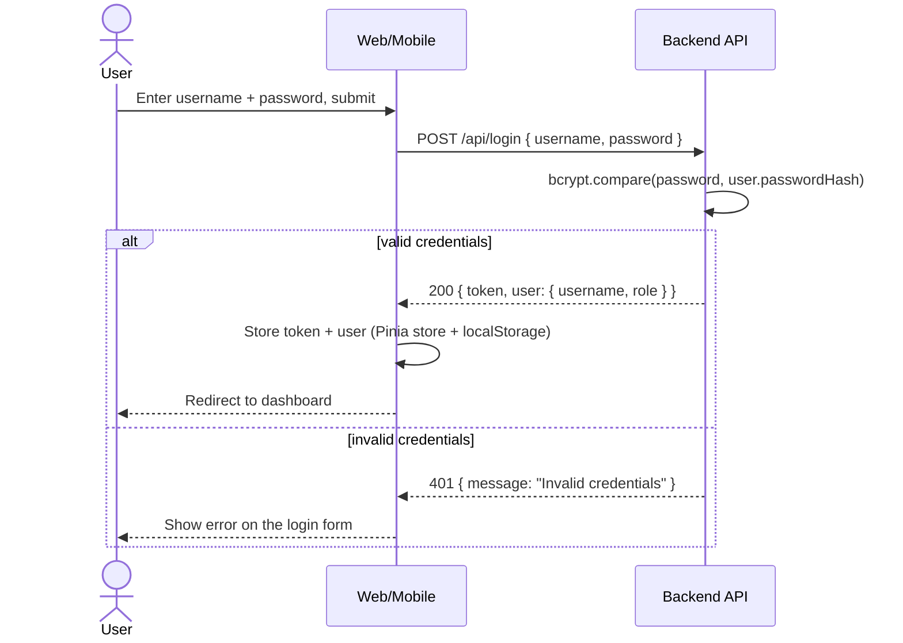
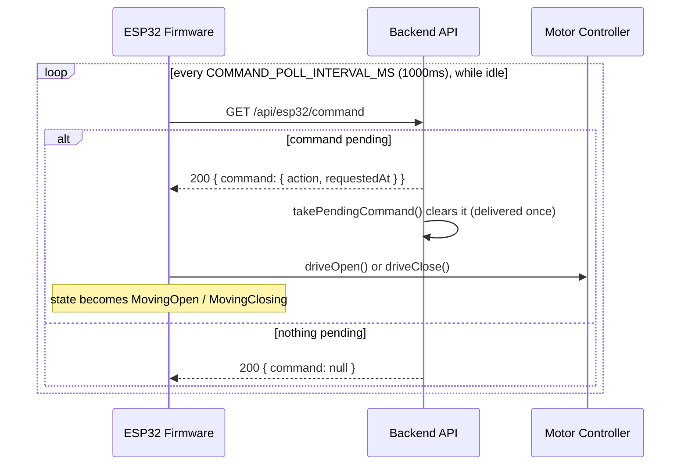

# Communication Sequence Diagrams

Full message flow between every component in the system, based on the current
implementation in `backend/`, `web/`, and `firmware/`.

**Participant note:** "Web/Mobile" below refers to the single Vue web dashboard in
`web/` — there is no separate native mobile app in this repository. The dashboard is
responsive and usable from both desktop and mobile browsers, but it is one
implementation, not two.

"Motor Controller" refers to the `motor_control` module (`firmware/src/motor_control.cpp`),
which runs inside the ESP32 firmware, not over the network — its arrows below
represent in-process function calls, not HTTP requests.

## 1. Login



## 2. Open gate

`POST /api/control` only **queues** a command — it does not move the motor directly.
See "ESP32 polling workflow" and "Status reporting" below for how the move actually
happens.

```mermaid
sequenceDiagram
    actor User
    participant Web as Web/Mobile
    participant API as Backend API

    User->>Web: Click "Open"
    Web->>API: POST /api/control { action: "open" } (Bearer token)
    API->>API: setPendingCommand("open"); log "Gate open requested"
    API-->>Web: 200 { gate: { status, updatedAt } } (still the pre-move status)
    Web->>API: GET /api/status (immediate refresh)
    Web->>API: GET /api/logs (immediate refresh)
    API-->>Web: current gate + logs (status unchanged so far)
    Web-->>User: Status pill still shows the old value until the ESP32 acts
```

## 3. Close gate

Identical flow to Open, with `action: "close"`:

```mermaid
sequenceDiagram
    actor User
    participant Web as Web/Mobile
    participant API as Backend API

    User->>Web: Click "Close"
    Web->>API: POST /api/control { action: "close" } (Bearer token)
    API->>API: setPendingCommand("close"); log "Gate close requested"
    API-->>Web: 200 { gate: { status, updatedAt } } (still the pre-move status)
    Web->>API: GET /api/status (immediate refresh)
    Web->>API: GET /api/logs (immediate refresh)
    API-->>Web: current gate + logs (status unchanged so far)
    Web-->>User: Status pill still shows the old value until the ESP32 acts
```

`"toggle"` (the dashboard's third button) also exists — the backend resolves it to a
concrete `"open"`/`"close"` direction server-side using the current `gateState.status`
before queuing, so from this point on it follows the same flow as above.

## 4. ESP32 polling workflow

The backend never pushes to the firmware — every request here is initiated by the
firmware itself, on a fixed interval, only while idle.



## 5. Status reporting

```mermaid
sequenceDiagram
    participant MC as Motor Controller
    participant FW as ESP32 Firmware
    participant API as Backend API
    participant Web as Web/Mobile

    loop every loop() tick, while moving
        FW->>FW: digitalRead(matching reed switch)
    end
    Note over FW: Reed switch triggers (LOW)
    FW->>MC: stop()
    FW->>API: POST /api/esp32/report { status: "open" | "closed" }
    API->>API: gateState.status updated; log "ESP32 reported <status>"
    API-->>FW: 200 { gate }
    Note over FW,API: If this request fails, firmware does not retry -\nbackend keeps the stale status (docs/state-machine.md)

    loop every 5s, while dashboard mounted
        Web->>API: GET /api/status
        Web->>API: GET /api/logs
        API-->>Web: current gate + logs
    end
    Web-->>Web: Status pill and activity list update to the real position
```

If the firmware's safety cutoff fires instead of the reed switch (see
`docs/state-machine.md`), step 3-5 above never happen — no report is sent, and the
backend's status stays at its last known value.
