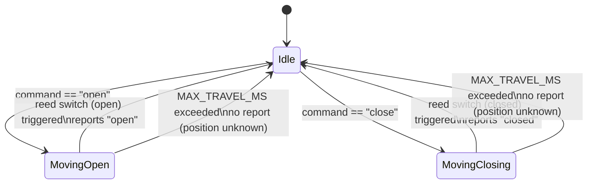

# Firmware State Machine

Documents the state machine implemented in `firmware/src/gate_state.cpp`
(`GateState::begin()` / `GateState::update()`), which is the only module that tracks
gate motion state in firmware.

## Purpose

Coordinates polling the backend for pending commands, driving the motor in the
requested direction, watching the matching reed switch to know when to stop, and
enforcing a maximum-travel-time safety cutoff — while never blocking (`update()` is
called once per `loop()` tick, with all timing based on `millis()`).

## States

The implementation defines exactly three states (`enum class Motion` in
`gate_state.cpp`, private to the module — not exposed via `gate_state.h`):

| State | Meaning |
|---|---|
| `Idle` | No movement in progress. Polls the backend for a pending command. |
| `MovingOpen` | Motor driving open (`MotorControl::driveOpen()` called). Watching `PIN_REED_OPEN`. |
| `MovingClosing` | Motor driving closed (`MotorControl::driveClose()` called). Watching `PIN_REED_CLOSED`. |

**There is no dedicated `Error` state in the current implementation.** The closest
equivalent is the safety-cutoff path below, which returns to `Idle` without ever
reporting a position — see "Error handling".

Gate *position* (open/closed) is not tracked in this enum at all — that lives in the
backend's `gateState.status` (`docs/api.md`), updated only when `ApiClient::reportStatus()`
succeeds. Firmware's `Motion` only ever describes whether the motor is currently moving.

## State transition table

| From | To | Condition | Action taken |
|---|---|---|---|
| `Idle` | `Idle` | Poll returns no pending command | None |
| `Idle` | `MovingOpen` | Poll returns `{ action: "open" }` | `MotorControl::driveOpen()`; record `moveStartMillis` |
| `Idle` | `MovingClosing` | Poll returns `{ action: "close" }` | `MotorControl::driveClose()`; record `moveStartMillis` |
| `MovingOpen` | `Idle` | `digitalRead(PIN_REED_OPEN) == LOW` | `MotorControl::stop()`; `ApiClient::reportStatus(GatePosition::Open)` |
| `MovingOpen` | `Idle` | `millis() - moveStartMillis > MAX_TRAVEL_MS` (reed not yet triggered) | `MotorControl::stop()`; **no report sent** |
| `MovingClosing` | `Idle` | `digitalRead(PIN_REED_CLOSED) == LOW` | `MotorControl::stop()`; `ApiClient::reportStatus(GatePosition::Closed)` |
| `MovingClosing` | `Idle` | `millis() - moveStartMillis > MAX_TRAVEL_MS` (reed not yet triggered) | `MotorControl::stop()`; **no report sent** |

## Transition conditions in detail

- **Command polling** (`pollForCommand()`, only runs while `Idle`): gated by
  `millis() - lastPollMillis >= COMMAND_POLL_INTERVAL_MS` (1000ms, `config.h`) so the
  backend is not hit on every single `loop()` iteration.
- **Reed switch checks** (`handleMoving()`, only runs while moving): read on every
  `loop()` tick, no polling interval — the motor stops as soon as possible after the
  switch triggers.
- Only the reed switch matching the **current** direction is read; e.g. while
  `MovingOpen`, `PIN_REED_CLOSED` is never checked.

## Timeout behaviour

`MAX_TRAVEL_MS` (20000ms, `config.h`) is checked unconditionally on every tick while
moving, independent of the reed-switch read. If a move exceeds this duration without
the matching reed switch triggering, the motor is stopped and the state returns to
`Idle` — this is a fallback safety mechanism, not the primary stop condition (the reed
switch is). The constant is a placeholder and is expected to be calibrated against the
real motor's actual travel time.

## Error handling

The current firmware has a narrow, specific notion of failure — there is no generic
error state, retry policy, or alarm:

- **Safety-cutoff timeout** (above): motor stops, state returns to `Idle`, but
  **no `POST /api/esp32/report` call is made**. The backend's `gateState.status`
  therefore keeps its last known value — from the backend's perspective, the gate's
  real position is now stale/unknown until a future move successfully reports.
- **`ApiClient::pollCommand()` failures** (WiFi down, backend unreachable, non-200
  response, unparsable body): the function returns `GateCommand::None`
  (`firmware/src/api_client.cpp`), which is indistinguishable from "nothing pending."
  The firmware simply polls again on the next interval — no error is logged or
  surfaced beyond `Serial` output implied by the module boundaries.
- **`ApiClient::reportStatus()` failures**: `gate_state.cpp` calls
  `ApiClient::reportStatus(...)` but does **not** check its returned `bool`. If the
  `POST /api/esp32/report` call fails (network drop right as the gate finishes
  moving, for example), the firmware has no retry — the physical move succeeded, but
  the backend never learns about it, and `gateState.status` stays stale until the
  next successful move.

There is no distinct "error" or "unknown" status value anywhere in this system today
(firmware, backend API, or web UI) — see `docs/api.md` and `docs/architecture.md` for
the same limitation from the backend's side.
